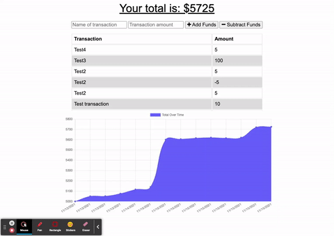

# online-offline-budget-trackers

Homework 15 - Unit 19 PWA Homework: Online/Offline Budget Trackers

## what did I do?

This assignment required building a functional PWA. We were tasked with creating and registering a service working and setting up and using indexedDB when the application is offline. We were also introduced to the manifest.json file in this assignment.

## what do I need to explain

This project was deployed on Heroku and uses MongoDB Atlas as a database.

## heroku deployment link

https://budget-tracker-bretpeters3n.herokuapp.com/

## animated GIF project walk through

[]
